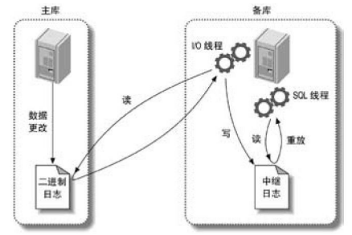

# MySQL

## # MySQL 存储引擎

> [《高性能 MySQL》- 第 1 章 MySQL 架构与历史](https://book.douban.com/subject/23008813/)

### InnoDB 存储引擎

InnoDB 是 MySQL 的默认事务型引擎，也是最重要、使用最广泛的存储引擎。它被设计用来处理大量的短期（short-lived）事务，短期事务大部分情况是正常提交的，很少会被回滚。InnoDB 的性能和自动崩溃恢复特性，使得它在非事务型存储的需求中也很流行。

InnoDB 采用 MVCC 来支持高并发，并且实现了四个标准的隔离级别。其默认级别是 REPEATABLE READ（可重复读），并且通过间隙锁（next-key locking）策略防止幻读的出现。间隙锁使得 InnoDB 不仅仅锁定查询涉及的行，还会对索引中的间隙进行锁定，以防止幻影行的插入。

### MyISAM 存储引擎

MyISAM 提供了大量的特性，包括全文索引、压缩、空间函数（GIS）等，但 MyISAM 不支持事务和行级锁，而且有一个毫无疑问的缺陷就是崩溃后无法安全恢复。对于只读的数据，或者表比较小、可以忍受修复（repair）操作，则依然可以继续使用 MyISAM。

### 部分引擎对比

|  存储引擎   |  事务  |        锁粒度        |            主要应用            |           忌用           |
| :---------: | :----: | :------------------: | :----------------------------: | :----------------------: |
|   InnoDB    |  支持  |   支持MVCC的行级锁   |            事务处理            |            无            |
|   MyISAM    | 不支持 | 支持并发操作的表级锁 |         SELECT、INSERT         |       读写操作频繁       |
| MRG_MYISAM  | 不支持 | 支持并发插入的表级锁 |       分段归档、数据仓库       |    全局查找过多的场景    |
|   Archive   | 不支持 |        行级锁        | 日志记录、只支持insert、select | 需要随机读取，更新，删除 |
| NDB Cluster |  支持  |        行级锁        |            高可用性            |        大部分应用        |

### 引擎的选取因素

- **事务**

  如果应用需要事务支持，那么 InnoDB 是目前最稳定并且经过验证的选择。如果不需要事务，并且主要是 SELECT 和 INSERT 操作，那么 MyISAM 是不错的选择。一般日志型的应用比较符合这一特性。

- **备份**

  备份的需求也会影响存储引擎的选择。如果可以定期地关闭服务器来执行备份，那么备份的因素可以忽略。反之，如果需要在线热备份，那么选择 InnoDB 就是基本的要求。

- **崩溃恢复**

  数据量比较大的时候，系统崩溃后如何快速地恢复是一个需要考虑的问题。相对而言，MyISAM 崩溃后发生损坏的概率比 InnoDB 要高很多，而且恢复速度也要慢。。

- **特有的特性**

  最后，有些应用可能依赖一些存储引擎所独有的特性或者优化，比如很多应用依赖聚簇索引的优化。另外，MySQL 中也只有 MyISAM 支持地理空间搜索。如果一个存储引擎拥有一些关键的特性，同时却又缺乏一些必要的特性，那么有时候不得不做折中的考虑，或者在架构设计上做一些取舍。某些存储引擎无法直接支持的特性，有时候通过变通也可以满足需求。

## # 主从复制

> [《高性能 MySQL》- 第 10 章 复制](https://book.douban.com/subject/23008813/)

### 概述

MySQL 支持两种复制方式：基于行的复制和基于语句的复制。这两种方式都是通过在主库上记录二进制日志、在备库重放日志的方式来实现异步的数据复制。MySQL 能够在这两种复制模式间动态切换。默认情况下使用的是基于语句的复制方式，但如果发现语句无法被正确地复制，就切换到基于行的复制模式。

- **基于语句的复制**

  在 MySQL 5.0 及之前的版本中只支持基于语句的复制（也称为逻辑复制）。基于语句的复制模式下，主库会记录那些造成数据更改的查询，当备库读取并重放这些事件时，实际上只是把主库上执行过的 SQL 再执行一遍。

  优点：

  - 实现简单。
  - 二进制里的事件更加紧凑。
  - 当主备的模式不同时，逻辑复制能够在多种情况下工作。
  - 在服务器上发生的变更都以一种容易理解的方式运行。这样当出现问题时可以很好地去定位。

  缺点：

  - 主从库执行环境不同，存在在无法被正确复制的 SQL。
  - 存储过程和触发器在使用基于语句的复制模式时也可能存在问题。
  - 更新必须是串行的。
  - 不是所有引擎都支持这种复制模式。

- **基于行的复制**

  MySQL 5.1 开始支持基于行的复制，这种方式会将实际数据记录在二进制日志中，跟其他数据库的实现比较相像。

  优点：

  - 可以正确地复制每一行。对于所有的 SQL 构造、触发器、存储过程等都能正确执行。
  - 不要求这种强串行化是可重复的，可以减少锁的使用。
  - 有一个更好的数据变更记录，能够更加清楚地知道服务器上发生了哪些更改。
  - 一些情况下基于行的二进制日志还会记录发生改变之前的数据，有利于某些数据恢复。
  - 无须像基于语句的复制那样需要为查询建立执行计划并执行查询，占用 CPU 更少。
  - 能够帮助更快地找到并解决数据不一致的情况。

  缺点：

  - 语句没有在日志里记录，无法判断执行了哪些 SQL。
  - 不是执行 SQL，无法知道服务器正在做什么。当出现问题时，可能很难找到问题所在。
  - 基于行的日志无法处理诸如在备库修改表的 schema 这样的情况，而基于语句的日志可以。
  - 很难进行时间点恢复。

### 复制解决的问题

- **数据分布**

  可以在不同的地理位置分布数据备份，例如不同的数据中心。

- **负载均衡**

  通过 MySQL 复制可以将读操作分布到多个服务器上，实现对读密集型应用的优化，并且实现很方便，通过简单的代码修改就能实现基本的负载均衡。

- **备份**

  对于备份来说，复制是一项很有意义的技术补充，但复制既不是备份也不能够取代备份。

- **高可用和故障切换**

  复制能够帮助应用程序避免 MySQL 单点失败，一个包含复制的设计良好的故障切换系统能够显著地缩短宕机时间。

- **MySQL 升级测试**

  使用一个更高版本的 MySQL 作为备库，保证在升级全部实例前，查询能够在备库按照预期执行。

### 复制如何工作

总的来说，MySQL 的复制有三个步骤：

1. 在主库上把数据更改记录到二进制日志（Binary Log）中（这些记录被称为二进制日志事件）。
   - 在每次准备提交事务完成数据更新前，主库将数据更新的事件记录到二进制日志中。
   - MySQL 会按事务提交的顺序而非每条语句的执行顺序来记录日志。
   - 在记录日志后，主库会告诉存储引擎可以提交事务了。
2. 备库将主库上的日志复制到自己中继日志（Relay Log）中。
   - 备库启动 I/O 线程跟主库建立一个普通的客户端连接。
   - 主库上启动一个特殊的二进制转储（binlog dump）线程，用于读取主库上的二进制日志中的事件。
   - 备库 I/O 线程将接收到的事件记录到中继日志中。
3. 备库读取中继日志中的事件，将其重放到数据之上。
   - 备库的 SQL 线程从中继日志中读取事件并在备库执行，实现备库的数据更新。

## # 索引

> [《高性能 MySQL》- 第 5 章 创建高性能的索引](https://book.douban.com/subject/23008813/)

### MySQL 支持的索引

1. B-tree 索引

   + B-tree 索引的特点
     + B-tree 索引以 B+ 树的结构存储数据
     + B-tree 索引能够加快数据的查询速度
     + B-tree 索引更适合进行范围查找

   + 在什么情况下可以用到 B-tree 索引
     + 全值匹配的查询，例：order_sn = '78675645645645'
     + 匹配最左前缀的查询，例：匹配联合索引的最左列的数据
     + 匹配列前缀查询，例：order_sn like '9876%'
     + 匹配范围值的查询，例：order_sn > '12345' and order_sn < '98765'
     + 精确匹配左前列并范围匹配另外一列
     + 只访问索引的查询

    + B-tree 的使用限制
      + 如果不是按照索引最左列开始查找，则无法使用索引
      + 使用索引时不能跳过索引中的列
      + Not in 和 \<\>（不等于，!=）操作无法使用索引
      + 如果查询中某个列的范围查询，则其右边所有列都无法使用索引

2. Hash 索引

    + Hash 索引的特点
      + Hash 索引是基于 Hash 表实现的，只有查询条件精确匹配 Hash 索引的所有列时，才能够使用到 Hash 索引
      + 对于 Hash 索引中的所有列，存储引擎都会为每一行计算一个 Hash 码，Hash 索引中存储的就是 Hash 码
    + Hash 索引的限制
      + Hash 索引必须进行二次查找
      + Hash 索引无法用于排序
      + Hash 索引不支持部分索引查找也不支持范围查找
      + Hash 索引中的 Hash 码的计算有可能存在 Hash 冲突

### 为什么要使用索引

1. 索引大大减少了存储引擎需要扫描的数据量
2. 索引可以帮助我们进行排序以避免使用临时表
3. 索引可以把随机 I/O 变为顺序 I/O

### 索引是不是越多越好

1. 索引会增写操作的成本
2. 太多的索引会增加查询优化器的选择时间

### 索引优化策略

1. 索引列上不能使用表达式或函数
2. 前缀索引和索引列的选择性
   + 针对列数据过长，但要注意前缀的重复性
3. 联合索引
   + 如何选择索引列的顺序
     + 经常会被使用的列优先
     + 选择性高的列优先
     + 宽度小的列优先
4. 覆盖索引
   + 优点
     + 可以优化缓存，减少磁盘 IO 操作
     + 可以减少随机 IO，变随机 IO 操作为顺序 IO 操作
     + 可以避免 Innodb 主键索引的二次查询
     + 可以避免 MyISAM 表进行系统调用
   + 无法使用覆盖索引的情况
     + 存储引擎不支持覆盖索引
     + 查询中使用了太多的列
     + 使用了双 % 号的 like 查询

### 使用索引来优化查询

1. 使用索引扫描来优化排序
   + 通过排序操作，按照索引顺序扫描数据
   + 索引的列顺序和 Order by 子句的顺序完全一致
   + 索引中所有列的方向（升序，降序）和 Order by 子句完全一致
   + Order by 中的字段全部在关联表中第一张表中
2. 模拟 Hash 索引优化查询（在表中添加一列存储该列数据的 Hash 值）
   + 只能处理键值的全值匹配查找
   + 所使用的 Hash 函数决定着索引键的大小
3. 利用索引优化锁
   + 索引可以减少锁定的行数
   + 索引可以加快处理速度，同时也加快了锁的释放

## # 查询优化

