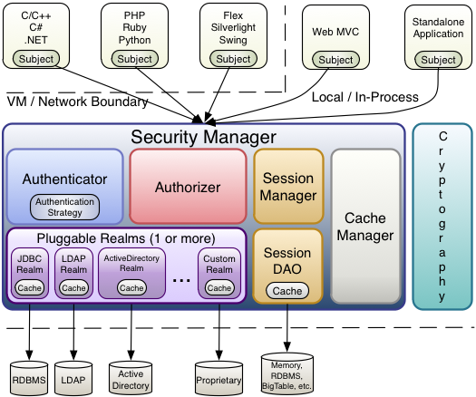

# Shiro

> [Apache Shiro](http://shiro.apache.org/index.html)

## # Apche Shiro 简介

> [Introduction to Apache Shiro](http://shiro.apache.org/introduction.html#introduction-to-apache-shiro)

### Apche Shiro 是什么？

Apache Shiro 是一个功能强大且灵活的开源安全框架，它可以清晰地处理身份验证、授权、企业会话管理，以及加密。

Apache Shiro 的首要目标是易于使用和理解。安全机制的实现有时可能非常复杂，甚至会让人觉得痛苦，但并非必须如此。框架应该尽可能地掩盖复杂性，并提供简洁直观的 API，以简化开发人员为确保应用程序的安全所做的工作。

以下是一些借助 Apache Shiro 可以做的事情：

- 对用户进行身份验证
- 对用户执行访问控制，例如：
  - 确定是否为用户分配了某个安全角色
  - 确定是否允许用户执行某些操作
- 可以在任何环境中使用 Session API，即使没有 Web 或 EJB容器
- 在身份验证、访问控制或会话生命周期内对事件作出反应
- 聚合一个或多个用户安全数据数据源，并将其呈现为单个复合用户“视图”
- 启用单点登录(SSO)功能
- 启用“记住我（Remember Me）”服务，无须登录便可与用户建立关联

  ……

  更重要的是，以上全部都集成在一个内聚且易于使用的 API 中。


Shiro 尝试为所有应用程序环境实现这些目标——从最简单的命令行应用程序到最大的企业应用程序，并且不强制依赖其他第三方框架，容器或应用程序服务器。当然，该项目旨在尽可能地集成到这些环境中，但它也可以在其他任何环境中开箱即用。

### Apache Shiro 特性

Apache Shiro 是一个具有许多功能的综合应用程序安全框架。下图显示了 Shiro 的主要关注点，本参考手册将以类似方式进行组织：


Shiro 针对的是 Shiro 开发团队所称的“应用程序安全的四大基石”——身份验证，授权，会话管理和加密：

- **身份验证（Authentication）：** 有时称之为“登录”，该行为用以证明用户是他们所说的那个人。
- **授权（Authorization）：** 访问控制的过程，即确定“谁”可以访问“什么”。
- **会话管理（Session Management）：** 管理特定于用户的会话，即使不在 Web 或 EJB 应用程序中。
- **加密（Cryptography）：** 使用加密算法保证数据安全，同时要易于使用。

在不同的应用程序环境中，还有其他特性支持和加强这些关注点，特别是：

- Web 支持：Shiro 的 Web 支持 API 可帮助 Web 应用程序轻松地获取保护。
- 缓存：缓存是 Apache Shiro API 中的一级公民，可确保安全操作保持快速和高效。
- 并发：Apache Shiro 的并发特性使其支持多线程应用程序。
- 测试：对测试的支持，可以帮助您编写单元和集成测试，确保你的代码如预期的那样得到保护。
- “Run As”：允许用户假定为其他用户身份（如果允许）的功能，有时在管理场景中很有用。
- “记住我（Remember Me）”：记住用户在不同会话中的身份，因此用户只需在强制登录时才进行登录。

## # Apache Shiro 架构

> [Apache Shiro Architecture](http://shiro.apache.org/architecture.html#apache-shiro-architecture)

Apache Shiro 的设计目标是通过直观性和易用性来简化应用程序安全性的实现。在某人（或某物）与应用程序交互的上下文中，Shiro 的核心设计模拟了大多数人对应用程序安全性的看法。

软件应用通常基于用户故事设计。也就是说，你通常会根据用户将要（或应该）怎么与软件交互的方式设计用户界面或服务API。例如，你可能会说，“与我的应用程序交互时，如果用户已经登陆，就会向他们显示一个按钮，他们可以单击该按钮查看其帐户信息。如果没有登录，则显示一个注册按钮。“

这个例子表明，编写应用程序主要是为了满足用户的需求。即使当前正与软件进行交互的“用户”不是人类，而是另一个软件系统，你仍然需要编写代码反映其行为。

Shiro 在自己的设计中体现了这些概念。通过搭配对软件开发人员来说已经很直观的内容，Apache Shiro 在几乎任何应用程序中都能保持直观和易于使用。

### 高层概述

在最高层次的概念上，Shiro 的架构有 3 个主要概念：`Subject`、`SecurityManager` 和 `Realms`。下图是这些组件如何交互的高级概述，我们将介绍其中的每个概念：


- **Subject**：正如我们在[教程](http://shiro.apache.org/tutorial.html)中提到的，`Subject` 本质上是当前正在进行操作的用户特定于安全性的“视图”。虽然“用户”这个词通常意味着一个人，但 `Subject` 可以是一个人，也可以代表第三方服务、守护进程帐户，cron作业或任何类似的东西 —— 基本上是当前与软件交互的任何东西。

  `Subject` 实例都被绑定（并且需要）到一个 `SecurityManager` 上。当你与一个 `Subject` 进行交互时，这些交互将转换为与 `SecurityManager` 特定于主题的交互。

- **SecurityManager**：`SecurityManager` 是 Shiro 架构的核心，它充当着“伞形”对象的角色，以协调其内部安全组件，共同构成一个对象图。值得注意的是，一旦为应用程序配置了 `SecurityManager` 及其内部对象图，通常就不需要再管它了，应用程序开发人员几乎将所有时间花在 `Subject` API上。

  稍后我们将详细讨论 `SecurityManager`，但重要的是要意识到，当你与 `Subject` 交互时，实际上是 `SecurityManager` 在幕后为 `Subject` 承担了所有繁重的工作。这反映在上面的基本流程图中。

- **Realms**：Realm 充当 Shiro 与应用程序安全数据之间的“桥梁”或“连接器”。当需要与与安全相关的数据（如用户帐户）进行实际交互以执行身份验证（登录）和授权（访问控制）时，Shiro 会从一个或多个为应用程序配置的 Realm 中查找这些内容。

  从这个意义上讲，Realm 本质上是一个特定于安全性的 [DAO](https://en.wikipedia.org/wiki/Data_access_object)：它封装了数据源的连接细节，并根据需要将相关数据提供给 Shiro。配置Shiro时，必须至少指定一个 Realm 用于身份验证和（或）授权。`SecurityManager` 可以配置多个 Realm，且至少需要一个。

  Shiro 提供了开箱即用的 Realm，可以连接到许多安全数据源（也称目录），如 LDAP、关系数据库（JDBC）、文本配置源（如INI和属性文件）等。如果缺省 Realm 不满足你的需求，你可以插入自己的 Realm 实现来表示自定义数据源。

  与其他内部组件一样，Shiro `SecurityManager` 管理着如何使用 Realm 来获取将被表示为 `Subject` 实例的安全数据和标识数据。

### 详细架构

下图展示了 Shiro 的核心架构概念，并对每个概念进行了简短的总结:



- **Subject**（[org.apache.shiro.subject.Subject](http://shiro.apache.org/static/current/apidocs/org/apache/shiro/subject/Subject.html)）
  当前与软件交互的实体（用户，第三方服务，cron 作业等）特定于安全性的“视图”。
- **SecurityManager**（[org.apache.shiro.mgt.SecurityManager](http://shiro.apache.org/static/current/apidocs/org/apache/shiro/mgt/SecurityManager.html)）
  如上所述，`SecurityManager` 是 Shiro 架构的核心。它主要是一个“伞形”对象，协调其托管组件，以确保它们一起平稳运行。它还管理每个应用程序用户的 Shiro 视图，因此它知道如何对每个用户执行安全操作。
- **Authenticator**（[org.apache.shiro.authc.Authenticator](http://shiro.apache.org/static/current/apidocs/org/apache/shiro/authc/Authenticator.html)）
  `Authenticator` 是负责执行和响应用户身份验证（登录）尝试的组件。当用户尝试登录时，将由`Authenticator` 执行该逻辑。`Authenticator` 知道如何与存储相关用户/帐户信息的一个或多个 Realm 进行协调。从这些 Realm 获得的数据将用于验证用户的身份，以确保用户确实是他们所说的那个人。
  - **Authentication Strategy**（[org.apache.shiro.authc.pam.AuthenticationStrategy](http://shiro.apache.org/static/current/apidocs/org/apache/shiro/authc/pam/AuthenticationStrategy.html)）
    如果配置了多个 Realm，`AuthenticationStrategy` 将对 Realm 进行协调以确定身份验证成功或失败的条件（例如，如果一个 Realm 验证成功但其他 Realm 失败，这次尝试是否成功？还是说需要所有 Realm 都验证成功？抑或是只需要第一个 Realm 验证成功就可以？）。
- **Authorizer**（[org.apache.shiro.authz.Authorizer](http://shiro.apache.org/static/current/apidocs/org/apache/shiro/authz/Authorizer.html)）
  `Authorizer` 是负责确定应用程序中用户访问控制的组件。它是一种最终决定用户是否被允许做某事的机制。与 `Authenticator` 类似，`Authorizer` 也知道如何协调多个后端数据源，以访问角色和权限信息。`Authorizer` 使用这些信息来确定是否允许用户执行特定的操作。
- **SessionManager**（[org.apache.shiro.session.mgt.SessionManager](http://shiro.apache.org/static/current/apidocs/org/apache/shiro/session/mgt/SessionManager.html)）
  `SessionManager` 知道如何创建和管理用户 `Session` 生命周期，为所有环境中的用户提供健壮的会话体验。这是安全框架领域的一个独特特性——即使没有可用的 Web、Servlet 或 EJB 容器，Shiro 也能够在任何环境中管理用户 Sessions。默认情况下，Shiro 将使用现有的会话机制（例如 Servlet 容器），但若是没有，比如在独立应用程序或非 Web 环境中，它将使用其内置的企业会话管理提供相同的编程过程。`SessionDAO` 的存在允许任何数据源用于持久会话。
  - **SessionDAO**（[org.apache.shiro.session.mgt.eis.SessionDAO](http://shiro.apache.org/static/current/apidocs/org/apache/shiro/session/mgt/eis/SessionDAO.html)）
    `SessionDAO` 代表 `SessionManager` 执行 `Session` 持久性（CRUD）操作。这允许将任何数据存储插入会话管理基础结构。
- **CacheManager**（[org.apache.shiro.cache.CacheManager](http://shiro.apache.org/static/current/apidocs/org/apache/shiro/cache/CacheManager.html)）
  `CacheManager` 负责创建和管理其他 `Shiro` 组件使用的 `Cache` 实例生命周期。由于 Shiro 可以访问许多后端数据源以进行身份验证，授权和会话管理，因此缓存一直是框架中极其重要的架构特性，其可以在使用这些数据源时提高性能。任何现代开源的或企业缓存产品都可以插入 Shiro，以提供快速有效的用户体验。
- **Cryptography**（[org.apache.shiro.crypto.\*](http://shiro.apache.org/static/current/apidocs/org/apache/shiro/crypto/package-summary.html)）
  加密机制是企业安全框架的自然补充。Shiro 的 `crypto` 软件包包含了易于使用和理解的密码、哈希（亦称摘要）和不同编解码器的实现。该软件包中的所有类都经过精心设计，易于使用且易于理解。使用 Java 原生加密支持的人都知道，它就像种很难被驯服的动物。Shiro 的 `crypto` API 简化了复杂的 Java 机制，使普通人易于使用。
- **Realms**（[org.apache.shiro.realm.Realm](http://shiro.apache.org/static/current/apidocs/org/apache/shiro/realm/Realm.html)）
  如上所述，Realm 充当 Shiro 与应用程序安全数据之间的“桥接”或“连接器”。当需要与安全相关的数据（如用户帐户）进行实际交互以执行身份验证（登录）和授权（访问控制）时，Shiro 会从一个或多个为应用程序配置的 Realm 中查找这些内容。你可以根据需要配置任意多个 Realm（通常每个数据源一个），Shiro 将根据身份验证和授权的需要与它们进行协调。

### SecurityManager

由于 Shiro 的API鼓励以 `Subject` 为中心的编程方法，所以大多数应用程序开发人员很少直接与`SecurityManager` 交互（框架开发人员有时可能会发现它很有用）。即便如此，了解 `SecurityManager` 功能仍然很重要，尤其是在为应用程序配置 `SecurityManager` 时。

### 设计

如前所述，应用程序的 `SecurityManager` 负责执行安全操作并管理所有应用程序用户的状态。在 Shiro 的默认 `SecurityManager` 实现中，这包括：

- Authentication（认证）
- Authorization（授权）
- Session Management（会话管理）
- Cache Management（缓存管理）
- [Realm](http://shiro.apache.org/realm.html) coordination（Realm 协调）
- Event propagation（事件传播）
- “Remember Me” Services（“记住我”服务）
- Subject creation（Subject 创建）
- Logout and more （登出等）

这只是尝试在单个组件中管理这么多的功能。如果将所有内容集中到一个实现类中，那么要使这些东西具有灵活性和可定制性将非常困难。

为了简化配置并实现灵活的配置和可插拔性，Shiro 的实现都是高度模块化的设计——模块化程度如此之高，以至于 SecurityManager 实现(及其类层次结构)根本做不了什么。相反，这些 `SecurityManager` 实现主要充当轻量级“容器”组件，将几乎将所有行为委托给嵌套和包装组件。这种“包装”设计反映在上面的详细架构图中。

当组件实际执行逻辑时，`SecurityManager` 实现知道如何以及何时协调组件以获得正确的行为。

`SecurityManager` 的实现和组件也兼容 JavaBean，它允许你(或配置机制)通过标准 JavaBean 访问器和修改器方法（get\*/set\*）轻松定制可插入组件。这意味着 Shiro 的体系结构模块化可以为自定义行为转化为非常容易的配置。

> 易于配置：因为 JavaBean 的兼容性，通过任何支持 JavaBean 样式配置的机制，例如 [Spring](http://shiro.apache.org/spring.html)，Guice，JBoss等，都可以很容易地使用自定义组件配置 `SecurityManager`。

## # Apache Shiro 术语

> [Apache Shiro Terminology](http://shiro.apache.org/terminology.html#apache-shiro-terminology)

## # 10 分钟教程

> [10 Minute Tutorial on Apache Shiro](http://shiro.apache.org/10-minute-tutorial.html)

### 介绍

欢迎来到 Apache Shiro 的 10 分钟教程！

通过这个简单快速的教程，你可以完全理解开发人员如何在应用程序中使用 Shiro。你应该可以在10分钟内完成。

### 概述

Apache Shiro 是什么？

Apache Shiro 是一个功能强大且易于使用的 Java 安全框架，它为开发人员提供了一种直观且全面的身份验证、授权、加密和会话管理解决方案。

实际上，它实现了管理应用程序安全性的所有方面，同时尽可能不碍事。它建立在良好的接口驱动设计和 OO 原则之上，在你能够想象的任何地方都支持自定义行为。此外，对于一切它都有合理的默认值，是应用程序安全性所能做到的最大程度的“不干涉（hands off）”。至少这是我们所追求的。

Apache Shiro 可以做什么？

太多了🙂。但我们不想让 QuickStart 变得臃肿。如果想了解它能为你做些什么，请查看[功能](http://shiro.apache.org/features.html)页面。此外，如果对我们是如何开始的以及我们为什么存在感兴趣，请参阅 [Shiro 的历史和使命](http://shiro.apache.org/what-is-shiro.html)页面。

好的。现在让我们开始吧!

> 注意：Shiro 可以在任何环境中运行，从最简单的命令行应用程序到最大的企业级 web 和集群应用程序，但在 QuickStart 中，我们将在一个简单的“main”方法中完成这个最简单的示例，这样你就可以对 API 有所了解。

### 下载

1. 确保安装了 JDK 1.6+ 和 Maven 3.0.3+。

2. 从[下载](http://shiro.apache.org/download.html)页面下载最新的“源代码分发（Source Code Distribution）” 。本示例中使用的是 1.4.0 分发版。

3. 解压：

   ```shell
   $ unzip shiro-root-1.4.0-source-release.zip
   ```

4. 进入 quickstart 目录：

   ```shell
   $ cd shiro-root-1.4.0/samples/quickstart
   ```

5. 运行 QuickStart：

   ```shell
   $ mvn compile exec:java
   ```

这个目标只会打印出一些日志消息，让你知道发生了什么，然后就会退出。在阅读本文时，可以随时查看下面的代码 `samples/quickstart/src/main/java/Quickstart.java`。对它进行修改并根据需要运行上述的  `mvn compile exec:java` 命令。

### Quickstart.java

上面引用的 `Quickstart.java` 文件包含了使你熟悉 API 的所有代码。现在让我们把它分成几块，这样你就可以很容易地理解发生了什么。

在几乎所有的环境中，你都可以通过以下调用方式获取当前正在执行的用户：

```java
Subject currentUser = SecurityUtils.getSubject();
```

通过 [`SecurityUtils`](http://shiro.apache.org/static/current/apidocs/org/apache/shiro/SecurityUtils.html).[`getSubject()`](http://shiro.apache.org/static/current/apidocs/org/apache/shiro/SecurityUtils.html#getSubject--) 方法，我们可以获得当前正在执行的[`Subject`](http://shiro.apache.org/static/current/apidocs/org/apache/shiro/subject/Subject.html)。“Subject”仅仅是应用程序用户特定于安全性的“视图”。实际上，我们本想把它称为“User”，因为这“很有意义”，但是我们决定不这么做：太多的应用程序现有的 API 中已经有了自己的 User 类或框架，我们不想与它们发生冲突。而且，在安全领域，`Subject` 实际上是公认的术语。好了，继续……

独立应用程序中的 `getSubject()` 调用可能返回一个应用程序中指定位置的用户数据对应的 `Subject`，而在服务器环境（例如 web 应用程序）中， `Subject` 则基于与当前线程或传入请求相关联的用户数据来获取。

既然有了 `Subject`，那能用它来做什么？

如果你希望在当前会话期间向应用程序用户提供内容，你可以获取其会话：

```java
Session session = currentUser.getSession();
session.setAttribute( "someKey", "aValue" );
```

`Session` 是特定于 Shiro 的实例，它不仅提供了常规 HttpSession 所提供的大部分内容，而且还有一些额外的好处和一个**很大的**区别：它不需要HTTP环境！

如果在 Web 应用程序内部部署，默认情况下 `Session` 将基于 `HttpSession`。但是，在非 Web 环境中，比如这个简单的 Quickstart，Shiro 默认会自动使用其自带的企业会话管理。这意味着无论部署环境如何，你都可以在任何层中的应用程序中使用相同的API。这打开了一个全新的应用程序世界，任何需要会话的应用程序都不需要被强制使用 `HttpSession` 或 EJB Stateful Session Bean。而且，任何客户端技术现在都可以共享会话数据。

现在你可以获得一个 `Subject` 和它们的 `Session`。那么真正有用的东西呢，比如检查是否允许它们执行某些操作，或者检查角色和权限?

我们只能对已知用户进行检查。`Subject` 上面的实例代表当前用户，但“谁”是当前用户？目前，他们是匿名的——也就是说，至少需要他们登录一次。所以，让我们这样做：

```java
if ( !currentUser.isAuthenticated() ) {
    //collect user principals and credentials in a gui specific manner
    //such as username/password html form, X509 certificate, OpenID, etc.
    //We'll use the username/password example here since it is the most common.
    //(do you know what movie this is from? ;)
    UsernamePasswordToken token = new UsernamePasswordToken("lonestarr", "vespa");
    //this is all you have to do to support 'remember me' (no config - built in!):
    token.setRememberMe(true);
    currentUser.login(token);
}
```

就是这样！再简单不过了。

但如果他们的登录尝试失败了怎们办？通过捕捉各种特定的异常，可以告诉你到底发生了什么，这允许你进行相应的处理和反应：

```java
try {
    currentUser.login( token );
    //if no exception, that's it, we're done!
} catch ( UnknownAccountException uae ) {
    //username wasn't in the system, show them an error message?
} catch ( IncorrectCredentialsException ice ) {
    //password didn't match, try again?
} catch ( LockedAccountException lae ) {
    //account for that username is locked - can't login.  Show them a message?
}
    ... more types exceptions to check if you want ...
} catch ( AuthenticationException ae ) {
    //unexpected condition - error?
}
```

你可以检查许多不同类型的异常，或者针对 Shiro 可能无法解释的自定义条件抛出你自己的异常。有关更多信息，请参阅 [AuthenticationException JavaDoc](http://shiro.apache.org/static/current/apidocs/org/apache/shiro/authc/AuthenticationException.html)。

> 提示：安全的最佳实践是向用户提供通用的登录失败消息，你应该不想帮助攻击者试图闯入你的系统吧。

好的，到现在为止，我们已经登录了用户。那还能做什么？

可以让我们看看他们是谁：

```java
//print their identifying principal (in this case, a username): 
log.info( "User [" + currentUser.getPrincipal() + "] logged in successfully." );
```

可以测试他们是否具有特定的角色：

```java
if ( currentUser.hasRole( "schwartz" ) ) {
    log.info("May the Schwartz be with you!" );
} else {
    log.info( "Hello, mere mortal." );
}
```

还可以看看他们是否有权对某种类型的实体进行操作：

```java
if ( currentUser.isPermitted( "lightsaber:weild" ) ) {
    log.info("You may use a lightsaber ring.  Use it wisely.");
} else {
    log.info("Sorry, lightsaber rings are for schwartz masters only.");
}
```

此外，我们可以执行一个极其强大的“实例级”权限检查——查看用户是否能够访问该类型的特定实例：

```java
if ( currentUser.isPermitted( "winnebago:drive:eagle5" ) ) {
    log.info("You are permitted to 'drive' the 'winnebago' with license plate (id) 'eagle5'.  " +
                "Here are the keys - have fun!");
} else {
    log.info("Sorry, you aren't allowed to drive the 'eagle5' winnebago!");
}
```

小菜一碟，是吧？

最后，当用户结束使用应用程序时，他们可以进行注销：

```java
currentUser.logout(); //removes all identifying information and invalidates their session too.
```

这就是在应用程序开发人员级别使用的 Apache Shiro 的核心内容。虽然有一些相当复杂的东西在幕后进行，使得这个工作如此优雅，但实际上就是这些。

你心中可能仍有疑惑，“到底是谁负责在登录期间获取用户数据（用户名和密码，角色和权限等），又是谁在运行时实际地去执行这些安全检查？”这些，通过实现 Shiro 所称的 [Realm](http://shiro.apache.org/realm.html) 并将其插入 Shiro 的配置中，就可以做到。

但是，如何配置 [Realm](http://shiro.apache.org/realm.html) 在很大程度上取决于你的运行时环境。例如，运行独立应用程序，或是基于 Web 的应用程序，或是基于 Spring 或 JEE 容器的应用程序，抑或是它们的组合。不过这种类型的配置超出了本文的范围，QuickStart 的目的是让你熟悉 API 和 Shiro 的概念。

当准备好了解更多详细信息时，你肯定希望阅读[身份验证指南](http://shiro.apache.org/java-authentication-guide.html)和[授权指南](http://shiro.apache.org/java-authorization-guide.html)。然后可以转到其他[文档](http://shiro.apache.org/documentation.html)，特别是[参考手册](http://shiro.apache.org/reference.html)，可以回答你的任何其他问题。或许你也想加入用户[邮件列表](http://shiro.apache.org/mailing-lists.html)——你会发现我们有一个很好的社区，人们愿意尽可能地提供帮助。

感谢你的关注。希望你能喜欢上 Apache Shiro！


> 注：本文自豪地借助“Google”和“有道”进行翻译，如果发现不通顺，请想他们提 issue 😀